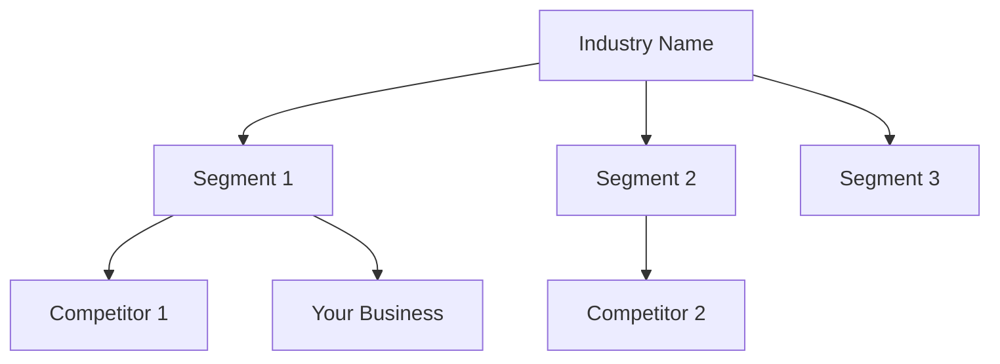
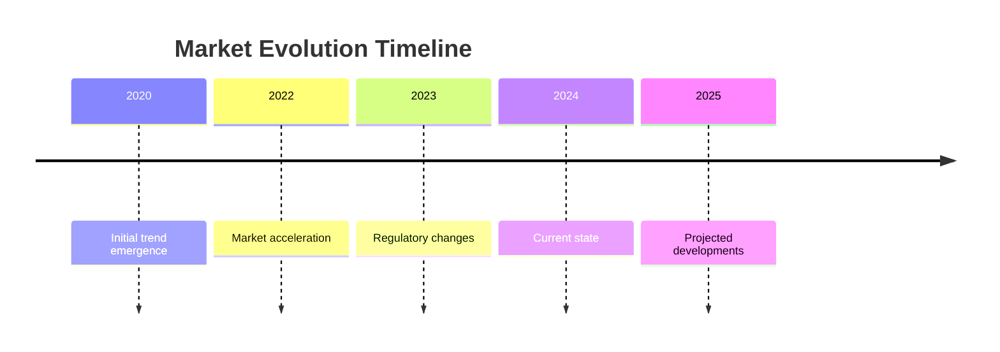

# Module 0: Research Phase

**PHASE: RESEARCH**  
**STATUS: READY FOR INPUT**  
**Est. Time: 45 Minutes**

## Business Intelligence Gathering

This is the first module in the Vibe Business Planning System. Here, you'll provide basic information about your business idea to generate comprehensive market research that will inform later modules.

### Module Purpose

- **Foundation Building**: Establish the knowledge base for your entire business plan
- **Market Validation**: Confirm your business idea has real-world potential
- **Audience Identification**: Discover exactly who will benefit from your solution
- **Competitive Analysis**: Understand the landscape you'll be entering

<!-- 
INSTRUCTIONS FOR USER:
1. This is the first file in a 5-part modular business idea development system
2. Fill in ONLY the business name and description below
3. Provide any URLs or resources you want the LLM to research
4. Submit this template to an LLM (like Manus or Claude)
5. Save the output to use as input for Module 1
-->

---

## Required Input

**IMPORTANT:** Complete the following fields

```
### Business Name (Required)
YOUR INPUT: [Enter your business name]

### Business Description (Required)
YOUR INPUT: [Write a brief description of your business idea - what it does and who it's for]

### Research URLs (Recommended)
YOUR INPUT: [Provide 3-5 URLs for the LLM to research (optional but recommended)]

### API Documentation (Optional)
YOUR INPUT: [Provide any API documentation or technical capabilities that underpin your business idea]

### Industry Focus (Optional)
YOUR INPUT: [Specify any particular industry aspects to focus on (optional)]

## LLM Instructions

**Please provide your research findings in the following sections, formatted in Markdown:**

### 1. Business Summary

Provide a 2-3 paragraph summary of the business concept based on the name and description. Focus on clarifying the core value proposition and target market.

### 2. Industry Overview

Provide a brief overview of the industry this business would operate in. Include market size, growth trends, and key players if available. Identify 2-3 similar businesses or competitors.

Create a Mermaid.js diagram showing the industry structure and where this business fits. Example:


    
### 3. Target Audience Insights

Identify the primary customer segments this business would serve. Describe their key characteristics, needs, and pain points. Explain why this audience would value the proposed solution.

### 4. Market Trends

Identify 3-5 relevant trends affecting this business space. Explain how these trends create opportunities or challenges. Note any regulatory or technological factors to consider.

If appropriate, create a Mermaid.js timeline diagram showing the evolution of key trends. Example:


    
### 5. Competitive Landscape

List 3-5 direct or indirect competitors. For each competitor, provide:
- Brief business description
- Strengths and weaknesses
- Unique positioning

Summarize how this business can differentiate itself in the competitive landscape.

### 6. SWOT Analysis

Provide a SWOT analysis in a structured format:
- **Strengths**: Internal advantages of the business concept
- **Weaknesses**: Internal limitations or challenges
- **Opportunities**: External favorable factors or trends
- **Threats**: External unfavorable factors or risks

Create a Mermaid.js diagram showing the SWOT analysis. Example:

```mermaid
quadrant-chart
    title SWOT Analysis
    x-axis Low Impact --> High Impact
    y-axis External --> Internal
    quadrant-1 Opportunities
    quadrant-2 Strengths
    quadrant-3 Threats
    quadrant-4 Weaknesses
```

### 7. Research Findings

Summarize the key findings from your research. Provide 3-5 data-backed insights that could inform business decisions. Identify any critical gaps in information that require further investigation.

### 8. Viability Assessment

Based on the research, provide an assessment of business viability. Rate the following on a scale of 1-5 (where 5 is highest):
- Market opportunity
- Problem validation
- Solution fit
- Competition intensity
- Entry barriers

Provide a brief explanation for each rating.

### 9. Recommendations

Provide 3-5 strategic recommendations based on research findings. Include specific actions the business founder should consider. Note any pivots or refinements to the original concept that might increase chances of success.

---

**Note:** Format your output as a well-structured Markdown document with clear headings and subheadings. Use bullet points, tables, and emphasis where appropriate to enhance readability.

## Next Steps

**After receiving the research output:**
1. Review the findings and save the information
2. Proceed to Module 1: Core Business Concept
3. Use insights from this research to inform your business identity development
4. The research will inform and enhance the development of your core business concept
