# 🚀 VIBE BUSINESS PLANNING SYSTEM 🚀

 

  

<h2>
  💡 Transform Your Business Vision Into Reality 💡
</h2>

<h3>
  <em>Enterprise-Grade Planning Framework for Visionary Entrepreneurs</em>
</h3>

> [!TIP]
> This system is designed for serious entrepreneurs who want to create a comprehensive, professional business plan that covers all aspects of bringing an idea to market.

---

  

## ✨ Key Benefits

|  |  |
|:---|:---|
| 📈 **Data-Driven Planning** | Make informed decisions with comprehensive market research and competitive analysis |
| 🧩 **Modular Approach** | Complete each module independently while maintaining a cohesive overall strategy |
| 🚀 **Launch Ready** | Generate concrete, actionable deliverables ready for immediate implementation |
| 🔄 **Adaptive Framework** | Flexible system that adapts to businesses across industries and scales |
| 💎 **Enterprise Methodologies** | Leverages proven business frameworks used by Fortune 500 companies |

> [!NOTE]
> ## 📋 System Overview
> 
> This enterprise-grade planning system guides you through 5 interconnected modules that systematically transform your idea into a comprehensive business plan. Each module builds upon the previous one, creating a cohesive business strategy with professional-quality deliverables at every stage.
>
> **🔄 Follow the guided process → Generate strategic insights → Create market-ready deliverables**

<h3>💠MODULAR SYSTEM ARCHITECTURE</h3>

> [!TIP]
> Each module is designed to be comprehensive yet flexible. You can complete modules sequentially or jump to specific ones based on your needs.

| 
MODULE
 | 
PURPOSE
 | 
PARTS
 | 
TIME
 | 
KEY DELIVERABLES
 |
|:---:|:---|:---:|:---:|:---|
| 
<h4>📊 M0</h4><h5>Research Phase</h5>
 | <kbd>INTELLIGENCE GATHERING</kbd> Comprehensive market and technical research foundation | 
<h3>1</h3>
 | 
<h4>1-2 HRS</h4>
 | <ul><li>Industry landscape analysis</li><li>Target audience profiling</li><li>Competitive positioning matrix</li><li>Technical capabilities assessment</li></ul> |
| 
<h4>💡 M1</h4><h5>Core Concept</h5>
 | <kbd>VISION DEFINITION</kbd> Crystallize your core business identity and value proposition | 
<h3>1</h3>
 | 
<h4>2-3 HRS</h4>
 | <ul><li>Precision-crafted elevator pitch</li><li>Comprehensive avatar analysis</li><li>High-impact million dollar message</li><li>Customer-centered empathy mapping</li></ul> |
| 
<h4>🯠M2</h4><h5>Solution & Products</h5>
 | <kbd>OFFERING ARCHITECTURE</kbd> Design your complete solution and product ecosystem | 
<h3>2</h3>
 | 
<h4>2-3 HRS</h4>
 | <ul><li>Signature transformation pathway</li><li>Strategic product ladder design</li><li>Engagement gamification framework</li><li>Value proposition canvas mapping</li></ul> |
| 
<h4>📈 M3</h4><h5>Business Model & Market</h5>
 | <kbd>STRATEGIC POSITIONING</kbd> Define your business model and market fit strategy | 
<h3>3</h3>
 | 
<h4>3-4 HRS</h4>
 | <ul><li>Complete business model canvas</li><li>Multi-dimensional market analysis</li><li>Nine strategic framework applications</li><li>Competitive advantage positioning</li></ul> |
| 
<h4>⚙️ M4</h4><h5>Implementation & Financials</h5>
 | <kbd>OPERATIONAL PLANNING</kbd> Create implementation roadmap and financial projections | 
<h3>2</h3>
 | 
<h4>2-3 HRS</h4>
 | <ul><li>Phased implementation timeline</li><li>Comprehensive financial modeling</li><li>Strategic risk mitigation planning</li><li>Scalability & growth engineering</li></ul> |
| 
<h4>🆠M5</h4><h5>Concrete Products</h5>
 | <kbd>MARKET READINESS</kbd> Specify launch-ready products and service offerings | 
<h3>3</h3>
 | 
<h4>2-3 HRS</h4>
 | <ul><li>Market-ready product specifications</li><li>Fully-defined service deliverables</li><li>Quick-win implementation projects</li><li>Specialized market niche solutions</li></ul> |

> [!IMPORTANT]
> ## 🔄 ENTERPRISE WORKFLOW SYSTEM

```mermaid
flowchart TD
    Start(["🚀 INITIATE PROCESS"]) --> ModulePrep{"⚡ PREPARATION PHASE"};
    ModulePrep --> Module0["📊 M0: RESEARCH PHASE"];
    Module0 --> Module1["💡 M1: CORE BUSINESS CONCEPT"];
    Module1 --> Module2a["🎯 M2: SOLUTION & PRODUCTS (P1)"];
    Module2a --> Module2b["🎯 M2: SOLUTION & PRODUCTS (P2)"];
    Module2b --> Module3a["📈 M3: BUSINESS MODEL (P1)"];
    Module3a --> Module3b["📈 M3: BUSINESS MODEL (P2)"];
    Module3b --> Module3c["📈 M3: BUSINESS MODEL (P3)"];
    Module3c --> Module4a["⚙️ M4: IMPLEMENTATION (P1)"];
    Module4a --> Module4b["⚙️ M4: IMPLEMENTATION (P2)"];
    Module4b --> Module5a["🏆 M5: CONCRETE PRODUCTS (P1)"];
    Module5a --> Module5b["🏆 M5: CONCRETE PRODUCTS (P2)"];
    Module5b --> Module5c["🏆 M5: CONCRETE PRODUCTS (P3)"];
    Module5c --> Complete(["🔥 MARKET-READY PLAN"]);

    %% Style Classes
    classDef startEnd fill:#4CAF50,stroke:#2E7D32,stroke-width:3px,color:white,font-weight:bold;
    classDef phase fill:#5BCEFA,stroke:#0288D1,stroke-width:2px,color:#01579B,font-weight:bold;
    classDef module fill:#F5A9B8,stroke:#C2185B,stroke-width:2px,color:#880E4F,font-weight:bold;
    
    %% Apply Classes
    class Start,Complete startEnd;
    class ModulePrep phase;
    class Module0,Module1,Module2a,Module2b,Module3a,Module3b,Module3c,Module4a,Module4b,Module5a,Module5b,Module5c module;
```

<h3>📊 INTERACTIVE PROCESS MAP</h3>

### 📈 2025 BUSINESS PLANNING TIMELINE

  

## 🚀 Quick Start Guide

| <h3>🔹 Module</h3> | <h3>📝 Instructions</h3> |
|:---:|:---|
| <h4>📊 Module 0</h4> | 1. Open `Module 0_ Research Phase.md` 2. Fill in your business name and description 3. Provide relevant URLs for research 4. Submit to an LLM for processing |
| <h4>💡 Module 1</h4> | 1. Open `Module 1_ Core Business Concept.md` 2. Paste Module 0 output into the research_findings section 3. Fill in any requested additional information 4. Submit to an LLM for processing |
| <h4>🯠Module 2</h4> | 1. Open both Module 2 parts sequentially 2. For each part, paste previous module output 3. Follow the guided prompts for solution design 4. Submit each part to an LLM for processing |
| <h4>📈 Module 3</h4> | 1. Work through all three parts of Module 3 in order 2. Each part builds on previous modules' outputs 3. Focus on business model development 4. Submit each part separately to an LLM |
| <h4>⚙️ Module 4</h4> | 1. Complete both implementation parts sequentially 2. Use outputs from Modules 0-3 as foundation 3. Develop operational and financial plans 4. Submit each part to an LLM for processing |
| <h4>🆠Module 5</h4> | 1. Work through all three parts of final module 2. Focus on concrete product specifications 3. Build comprehensive go-to-market strategy 4. Submit each part separately to an LLM |

> [!IMPORTANT]
> For best results, complete each module in sequence, as each builds upon the insights and deliverables from previous modules. Save all LLM outputs to ensure continuity throughout the process.

## 🌎 INTERACTIVE MODULE WORKFLOW

> [!TIP]
> Use this interactive checklist to track your progress through each module. Click the checkboxes to mark tasks as complete.

### ⚙️ PREPARATION PHASE

<h4>📡 INITIALIZE PROJECT</h4>

- [ ] &nbsp;Review the entire system architecture and workflow process
- [ ] &nbsp;Collect existing business documentation and research materials
- [ ] &nbsp;Schedule dedicated time blocks for each module completion
- [ ] &nbsp;Prepare collaborative environment for stakeholder input
- [ ] &nbsp;Set up document storage system for module outputs

### 📊 MODULE 0: RESEARCH PHASE

<h4>🌠MARKET INTELLIGENCE</h4>

| # | TASK | STATUS |
|:--:|:--|:--:|
| 01 | Define business name and core description | <kbd>[ ]</kbd> |
| 02 | Provide reference URLs for industry research | <kbd>[ ]</kbd> |
| 03 | Include API/technical documentation if applicable | <kbd>[ ]</kbd> |
| 04 | Submit template to LLM for processing | <kbd>[ ]</kbd> |
| 05 | Review and save comprehensive research output | <kbd>[ ]</kbd> |

### 💡 MODULE 1: CORE BUSINESS CONCEPT

<h4>🔠BUSINESS IDENTITY FORMATION</h4>

| # | TASK | STATUS |
|:--:|:--|:--:|
| 01 | Import complete Module 0 output into template | <kbd>[ ]</kbd> |
| 02 | Refine business name and core description | <kbd>[ ]</kbd> |
| 03 | Submit template to LLM for advanced processing | <kbd>[ ]</kbd> |
| 04 | Review name analysis, elevator pitch, and avatar profiles | <kbd>[ ]</kbd> |
| 05 | Validate million dollar message for market impact | <kbd>[ ]</kbd> |
| 06 | Archive finalized core concept documentation | <kbd>[ ]</kbd> |

### 🎯 MODULE 2: SOLUTION & PRODUCTS ARCHITECTURE

<h4>💼 PRODUCT ECOSYSTEM DESIGN</h4>

| # | TASK | STATUS |
|:--:|:--|:--:|
| 01 | Import Module 1 output into Part 1 template | <kbd>[ ]</kbd> |
| 02 | Process Part 1 through enterprise LLM framework | <kbd>[ ]</kbd> |
| 03 | Archive Part 1 strategic documentation | <kbd>[ ]</kbd> |
| 04 | Execute Part 2 LLM processing sequence | <kbd>[ ]</kbd> |
| 05 | Secure Part 2 output in version control system | <kbd>[ ]</kbd> |
| 06 | Synthesize Parts 1 and 2 into unified deliverable | <kbd>[ ]</kbd> |
| 07 | Evaluate signature solution transformation pathway | <kbd>[ ]</kbd> |
| 08 | Validate product ladder and premium pricing matrix | <kbd>[ ]</kbd> |
| 09 | Analyze gamification structure and delivery systems | <kbd>[ ]</kbd> |
| 10 | Finalize comprehensive solution architecture document | <kbd>[ ]</kbd> |

### 📈 MODULE 3: BUSINESS MODEL & MARKET STRATEGY

<h4>🌠STRATEGIC MARKET POSITIONING</h4>

| # | TASK | STATUS |
|:--:|:--|:--:|
| 01 | Import Module 2 output into Part 1 template | <kbd>[ ]</kbd> |
| 02 | Execute Part 1 LLM processing sequence | <kbd>[ ]</kbd> |
| 03 | Archive Part 1 business model documentation | <kbd>[ ]</kbd> |
| 04 | Process Part 2 through enterprise framework | <kbd>[ ]</kbd> |
| 05 | Secure Part 2 market analysis in version control | <kbd>[ ]</kbd> |
| 06 | Complete Part 3 advanced framework modeling | <kbd>[ ]</kbd> |
| 07 | Archive Part 3 strategic framework outputs | <kbd>[ ]</kbd> |
| 08 | Synthesize all parts into unified market strategy | <kbd>[ ]</kbd> |
| 09 | Validate all business model canvas elements | <kbd>[ ]</kbd> |
| 10 | Conduct market analysis and competitive review | <kbd>[ ]</kbd> |

**Advanced Strategic Framework Assessment:**

  

    <input type="checkbox"> Value Chain Analysis 
    <input type="checkbox"> Value Proposition Canvas 
    <input type="checkbox"> Product Market Fit Canvas 
    <input type="checkbox"> Empathy Map Canvas 
    <input type="checkbox"> PESTLE Analysis
  

  

    <input type="checkbox"> Porter's Five Forces 
    <input type="checkbox"> TOWS Matrix 
    <input type="checkbox"> BCG Matrix 
    <input type="checkbox"> Ansoff Matrix 
    <input type="checkbox"> Final Documentation
  

### ⚙️ MODULE 4: IMPLEMENTATION & FINANCIAL ENGINEERING

<h4>💸 OPERATIONAL EXECUTION PLANNING</h4>

| # | TASK | STATUS |
|:--:|:--|:--:|
| 01 | Import Module 3 output into implementation template | <kbd>[ ]</kbd> |
| 02 | Execute Part 1 operational planning sequence | <kbd>[ ]</kbd> |
| 03 | Archive implementation timeline documentation | <kbd>[ ]</kbd> |
| 04 | Process Part 2 financial modeling framework | <kbd>[ ]</kbd> |
| 05 | Secure financial projection data in version control | <kbd>[ ]</kbd> |
| 06 | Integrate operational and financial deliverables | <kbd>[ ]</kbd> |
| 07 | Validate multi-phase implementation timeline | <kbd>[ ]</kbd> |
| 08 | Review financial models and breakeven analytics | <kbd>[ ]</kbd> |
| 09 | Evaluate risk mitigation matrix and contingencies | <kbd>[ ]</kbd> |
| 10 | Formalize scalability and growth acceleration plan | <kbd>[ ]</kbd> |

<b>📈 Financial Dashboard Preview</b>

### 🏆 MODULE 5: MARKET-READY PRODUCT SPECIFICATION

<h4>🔥 LAUNCH-READY DELIVERABLES</h4>

| # | TASK | STATUS |
|:--:|:--|:--:|
| 01 | Import Module 4 output into product specification template | <kbd>[ ]</kbd> |
| 02 | Execute Part 1 product definition sequence | <kbd>[ ]</kbd> |
| 03 | Archive detailed product specifications in repo | <kbd>[ ]</kbd> |
| 04 | Process Part 2 service modeling framework | <kbd>[ ]</kbd> |
| 05 | Document service deliverables and parameters | <kbd>[ ]</kbd> |
| 06 | Complete Part 3 market implementation planning | <kbd>[ ]</kbd> |
| 07 | Archive specialized solutions and niche targeting | <kbd>[ ]</kbd> |
| 08 | Integrate all parts into unified product strategy | <kbd>[ ]</kbd> |
| 09 | Review price points and product positioning matrix | <kbd>[ ]</kbd> |
| 10 | Validate service delivery models and SLAs | <kbd>[ ]</kbd> |
| 11 | Prioritize quick-win projects for early market validation | <kbd>[ ]</kbd> |
| 12 | Finalize comprehensive roadmap with success metrics | <kbd>[ ]</kbd> |
| 13 | Submit complete product specifications for review | <kbd>[ ]</kbd> |

<b>💼 Product Launch Timeline</b>

### 🌟 FINAL EXECUTION PHASE

<h4>🚀 MARKET LAUNCH PREPARATION</h4>

| # | TASK | STATUS |
|:--:|:--|:--:|
| 01 | Synthesize all module outputs into comprehensive business plan | <kbd>[ ]</kbd> |
| 02 | Conduct holistic review for strategic alignment | <kbd>[ ]</kbd> |
| 03 | Execute gap analysis across all business dimensions | <kbd>[ ]</kbd> |
| 04 | Develop prioritized action matrix based on impact assessment | <kbd>[ ]</kbd> |
| 05 | Initiate immediate high-value action items | <kbd>[ ]</kbd> |
| 06 | Establish metrics dashboard for ongoing performance tracking | <kbd>[ ]</kbd> |
| 07 | Schedule strategic review cadence with stakeholders | <kbd>[ ]</kbd> |

> [!NOTE]
> Congratulations on completing the Vibe Business Planning System! You now have a comprehensive, enterprise-grade business plan ready for execution. This market-ready planning document represents your complete business strategy from initial concept to concrete products and services.

> [!IMPORTANT]
> ## 💥 EXCELLENCE OPTIMIZATION FRAMEWORK

<h3>📠BEST PRACTICES FOR PREMIUM RESULTS</h3>

  <h4 style="margin-top: 0; border-bottom: 2px solid rgba(255,255,255,0.3); padding-bottom: 10px; margin-bottom: 15px;">
    🧰 STRATEGIC SEQUENCING
  </h4>
  
<b>IMPERATIVE:</b> Complete all modules in their prescribed order.

  
<b>RATIONALE:</b> Each module builds upon the strategic foundations established in previous stages, ensuring architectural integrity throughout the planning process.

  <h4 style="margin-top: 0; border-bottom: 2px solid rgba(255,255,255,0.3); padding-bottom: 10px; margin-bottom: 15px;">
    🔥 MODULAR PROGRESSION
  </h4>
  
<b>IMPERATIVE:</b> For multi-part modules, process sequentially in numerical order.

  
<b>RATIONALE:</b> Each part builds a specific component of the enterprise framework, ensuring proper dependency resolution across the strategic implementation stack.

  <h4 style="margin-top: 0; border-bottom: 2px solid rgba(255,255,255,0.3); padding-bottom: 10px; margin-bottom: 15px;">
    🔗 INTEGRATION PROTOCOL
  </h4>
  
<b>IMPERATIVE:</b> Synthesize all module parts before advancing to subsequent modules.

  
<b>RATIONALE:</b> Creating a unified deliverable ensures complete strategic alignment before progressing to higher-order business planning activities.

  <h4 style="margin-top: 0; border-bottom: 2px solid rgba(255,255,255,0.3); padding-bottom: 10px; margin-bottom: 15px;">
    🔠PRECISION ENGINEERING
  </h4>
  
<b>IMPERATIVE:</b> Maximize specificity and detail throughout all inputs.

  
<b>RATIONALE:</b> Enhanced granularity in data inputs exponentially improves strategic clarity and actionable intelligence in downstream deliverables.

  <h4 style="margin-top: 0; border-bottom: 2px solid rgba(255,255,255,0.3); padding-bottom: 10px; margin-bottom: 15px;">
    📋 VALIDATION PROTOCOL
  </h4>
  
<b>IMPERATIVE:</b> Conduct comprehensive strategic review of all outputs.

  
<b>RATIONALE:</b> Thorough validation ensures alignment with business objectives and market positioning before advancing through the enterprise framework.

  <h4 style="margin-top: 0; border-bottom: 2px solid rgba(255,255,255,0.3); padding-bottom: 10px; margin-bottom: 15px;">
    🖼 VISUAL INTELLIGENCE
  </h4>
  
<b>IMPERATIVE:</b> Leverage Mermaid.js diagrams for strategic visualization.

  
<b>RATIONALE:</b> Advanced graphical representations significantly enhance comprehension of complex business relationships and dependency flows.

  <h4 style="margin-top: 0; border-bottom: 2px solid rgba(255,255,255,0.3); padding-bottom: 10px; margin-bottom: 15px;">
    🔠ITERATIVE REFINEMENT
  </h4>
  
<b>IMPERATIVE:</b> Employ strategic iteration for continuous optimization.

  
<b>RATIONALE:</b> Cyclical refinement with enhanced inputs produces exponentially improved strategic outcomes through progressive enhancement.

  <h4 style="margin-top: 0; border-bottom: 2px solid rgba(255,255,255,0.3); padding-bottom: 10px; margin-bottom: 15px;">
    👥 STAKEHOLDER INTEGRATION
  </h4>
  
<b>IMPERATIVE:</b> Strategically disseminate outputs for multi-channel feedback.

  
<b>RATIONALE:</b> Tactical collaboration with key stakeholders and potential investors creates critical validation loops that enhance market readiness.

## 🗃️ Module Descriptions

<h3>📊 Module 0: Research Phase</h3>

This initial module gathers essential information about your business idea, industry, and target market. It provides the foundational research needed for all subsequent modules. The LLM will analyze your business concept, research provided URLs, and examine any API documentation to create a comprehensive research base.

<b>Key Outputs</b>

- 🌐 Business summary and industry overview
- 💸 Target audience insights and market trends
- 📏 Competitive landscape analysis
- 💻 Technical capabilities assessment (if API docs provided)
- 📈 Industry structure and competitive positioning visualizations

<h3>💡 Module 1: Core Business Concept</h3>

This module defines the fundamental identity of your business. It develops your business name, elevator pitch, and detailed customer avatar. The LLM will create a compelling million dollar message and analyze your business concept from multiple angles.

<b>Key Outputs</b>

- 🏢 Business name analysis and elevator pitch
- 🔍 Industry categorization and inspiration sources
- 🔝 High-level user flow with visualization
- 👤 Comprehensive avatar analysis using the Avatar Framework
- 💰 Million Dollar Message following the formula
- 💭 Empathy Map Canvas for customer understanding

<h3>🎯 Module 2: Solution & Products (2 Parts)</h3>

This module translates your business concept into a concrete solution strategy and product offerings. It defines your signature solution, creates a complete product ladder, and develops engagement strategies.

<b>Part 1 Outputs</b>

- 🗺️ Signature solution with transformation pathway
- 🏅 Complete product ladder (core, mid-tier, premium)
- 💲 Pricing strategy and ascension model

<b>Part 2 Outputs</b>

- 🎮 Gamification elements for engagement and retention
- 🚀 Delivery mechanisms and customer experience
- 📆 Value Proposition Canvas and Product Market Fit Canvas

<h3>📈 Module 3: Business Model & Market (3 Parts)</h3>

This module creates a comprehensive business model and market analysis. It includes all elements of the Business Model Canvas plus nine advanced market frameworks to provide deep strategic insights.

<b>Part 1 Outputs</b>

- 🗺️ Complete Business Model Canvas (all nine elements)

<b>Part 2 Outputs</b>

- 📉 Detailed market analysis (size, growth, competition)
- 🏠 SWOT analysis and barriers to entry assessment
- ⛓️ Value Chain Analysis
- 🌍 PESTLE Analysis

<b>Part 3 Outputs</b>

- 👮 Porter's Five Forces Analysis
- 💠 TOWS Matrix
- 📊 BCG Matrix
- 📋 Ansoff Matrix

<h3>⚙️ Module 4: Implementation & Financials (2 Parts)</h3>

This module develops a practical implementation plan and financial projections. It creates a timeline for bringing your business to life, estimates costs and revenues, and identifies key metrics for success.

<b>Part 1 Outputs</b>

- 🗓 Detailed implementation timeline with phases
- 💰 Startup costs and revenue projections

<b>Part 2 Outputs</b>

- 📉 Breakeven analysis and funding requirements
- ⚠️ Risk identification and mitigation strategies
- 📈 Scalability plan for growth
- 🚪 Exit strategy and social impact assessment (if applicable)

<h3>🏆 Module 5: Concrete Products (3 Parts)</h3>

This final module creates specific, market-ready product and service specifications. It translates your business strategy into tangible offerings that could be immediately implemented.

<b>Part 1 Outputs</b>

- 💼 3-5 ready-to-launch products with detailed specifications

<b>Part 2 Outputs</b>

- 👔 3-5 ready-to-deliver services with clear deliverables
- 🎁 Quick-win implementation projects for early results

<b>Part 3 Outputs</b>

- 🌟 Specialized solutions for specific market niches
- 🗺️ Comprehensive implementation roadmap
- 📈 Success metrics and ROI calculations
- ◀️ Immediate action items to begin implementation

## 📊 Mermaid Diagram Support

This business planning system leverages Mermaid diagrams for visual representation of key concepts. GitHub supports Mermaid diagrams natively, allowing you to see visualizations directly in the markdown files.

### Example Mermaid Diagram

For best results when viewing Mermaid diagrams in this repository:

1. Use GitHub's web interface which has native Mermaid support
2. Ensure your browser is up-to-date
3. If diagrams don't render, try refreshing the page
4. For local editing, consider using an editor with Mermaid preview support (like VS Code with Markdown Preview Mermaid extension)

---

## 👨‍💻 About the Author

**Matty Squarzoni**

_Enterprise Strategy Consultant & Business Planning Expert_

Developer of the Vibe Business Planning System, combining Fortune 500 methodologies with practical implementation strategies for entrepreneurs and business leaders.

---

## 📃 LICENSE

MIT
